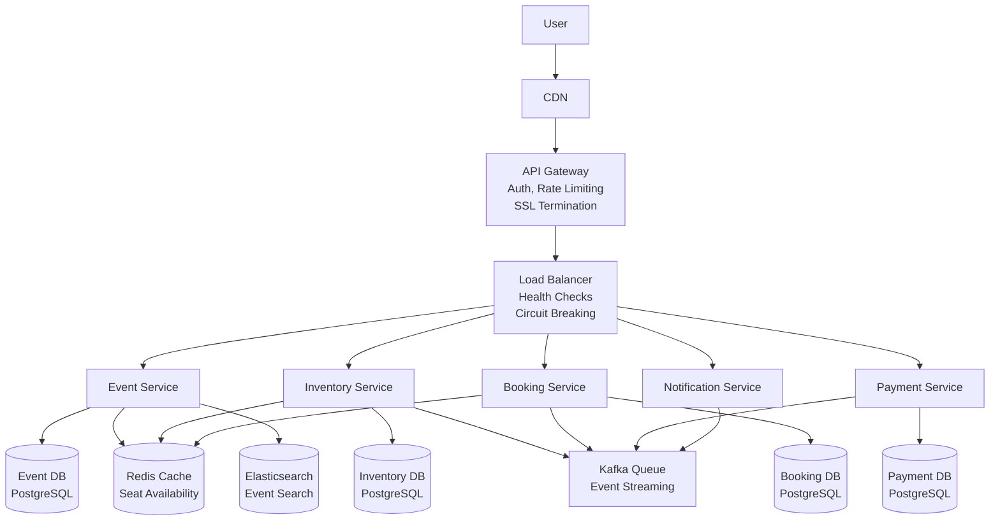
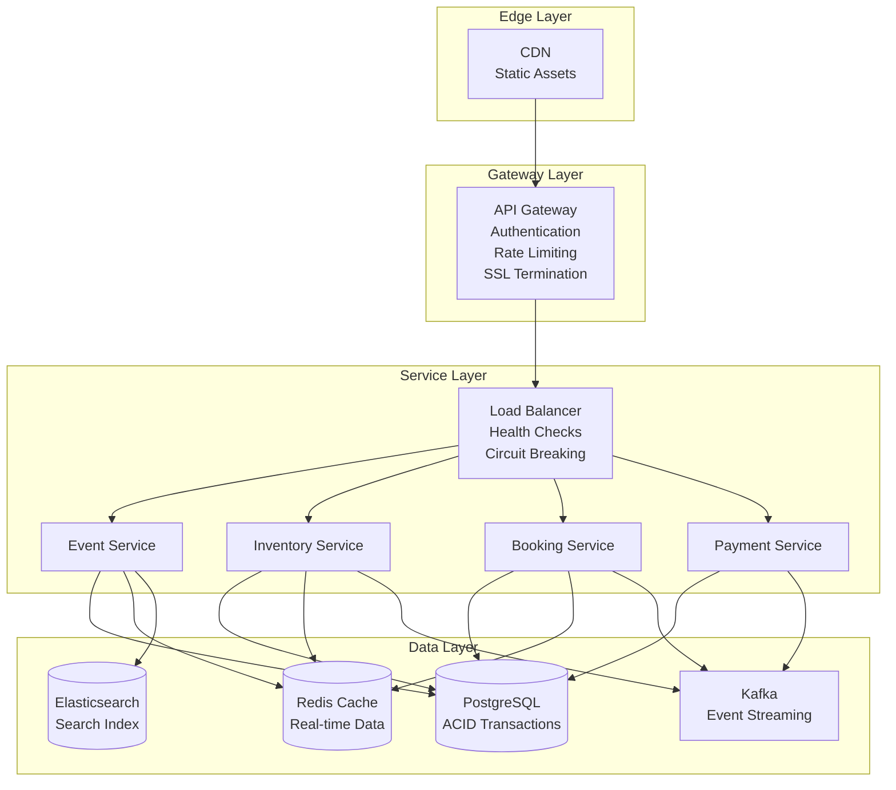

# Ticket Booking System Design - 30-Minute Interview Guide

## 🎯 Interview Timeline (30 minutes)

- **Requirements (5 min)**: Clarify functional/non-functional requirements
- **Capacity Estimation (3 min)**: Quick calculations with formulas
- **High-Level Design (8 min)**: Core services and API design
- **Deep Dive (10 min)**: Focus on 1-2 critical components
- **Scaling & Wrap-up (4 min)**: Discuss bottlenecks and solutions

---

## 1. Requirements Clarification (5 minutes)

### Key Questions to Ask:

- "What's the scale? How many concurrent users during peak?"
- "What's more important - consistency or availability?"
- "Do we need real-time seat updates or eventual consistency?"
- "What's the expected booking success rate?"

### Functional Requirements (Priority Order):

1. **Search Events** - Find events by location, date, category
2. **View Seat Map** - Display available seats with pricing
3. **Reserve Seats** - Hold seats temporarily (5-15 minutes)
4. **Process Payment** - Complete booking with payment
5. **Generate Tickets** - Digital ticket delivery

### Non-Functional Requirements:

- **Concurrency**: 100K concurrent users during major events
- **Consistency**: No double-booking (strong consistency needed)
- **Latency**: <200ms search, <500ms booking operations
- **Availability**: 99.9% uptime during peak periods

---

## 2. Capacity Estimation (3 minutes)

### 📊 Simple Formulas & Calculations

#### Traffic Estimation:

```
Peak Concurrent Users = 100,000
Booking Success Rate = 10% (industry standard)
Average Session Time = 3 minutes (browse → payment)

QPS Calculation:
- Read Operations (80%): 100K users × 0.8 ÷ 3 min × 60s = 26,667 QPS
- Write Operations (20%): 100K users × 0.2 ÷ 3 min × 60s = 6,667 QPS
- Total Peak QPS ≈ 33,334 QPS
```

#### Storage Estimation:

```
Events Data: 10K events × 10KB = 100MB
Seat Inventory: 10K events × 1K seats × 100 bytes = 1GB
User Data: 10M users × 1KB = 10GB
Bookings: 1M bookings/month × 500 bytes × 12 months = 6GB
Total: ~20GB (add 3x for growth) = 60GB
```

#### Memory Requirements:

```
Active Sessions: 100K users × 1KB session = 100MB
Cache (Hot Events): 1K events × 100KB = 100MB
Total Memory: ~500MB per server
```

---

## 3. High-Level Design (8 minutes)

### Core Services Architecture:



#### Essential Services:

1. **Event Service**: Event catalog and search
2. **Inventory Service**: Seat availability and reservations
3. **Booking Service**: Orchestrates booking workflow
4. **Payment Service**: Payment processing with retries
5. **Notification Service**: Booking confirmations

### Key APIs (Show 2-3 main ones):

#### Search Events:

```http
GET /api/events/search?city=NYC&date=2024-12-25&category=concert
```

#### Reserve Seats:

```http
POST /api/bookings/reserve
{
  "event_id": "evt123",
  "seat_ids": ["A1", "A2"],
  "user_id": "user456"
}
```

#### Complete Booking:

```http
POST /api/bookings/complete
{
  "reservation_id": "res789",
  "payment_method": "card_token",
  "idempotency_key": "uuid-12345"
}
```

### Database Design:

```sql
-- Core Tables (mention these quickly)
seats (seat_id, event_id, status, price, version)
seat_holds (hold_id, seat_id, user_id, expires_at)
bookings (booking_id, user_id, payment_status, idempotency_key)
```

---

## 4. Deep Dive Topics (10 minutes)

### 🔥 Critical Problem: Race Conditions

**Problem**: Multiple users booking the same seat simultaneously

**Solution**: Pessimistic Locking

```sql
-- Atomic seat reservation
BEGIN TRANSACTION;
SELECT * FROM seats WHERE seat_id = 'A1' FOR UPDATE;
UPDATE seats SET status = 'held' WHERE seat_id = 'A1';
INSERT INTO seat_holds (hold_id, seat_id, expires_at) VALUES (...);
COMMIT;
```

### 🔥 Critical Problem: Seat Hold Management

**Problem**: Users abandon booking process, seats stuck in "held" state

**Solution**: Timeout-based cleanup

- Hold expires after 10 minutes
- Background job releases expired holds every 30 seconds
- 
- Update cache immediately when seats are released

### 🔥 Critical Problem: Payment Failures

**Problem**: Payment fails but user retries, potential double-charging

**Solution**: Idempotency Keys

```python
def process_payment(payment_data, idempotency_key):
    # Check if already processed
    existing = db.get_booking_by_idempotency_key(idempotency_key)
    if existing:
        return existing  # Return previous result

    # Process new payment
    result = payment_gateway.charge(payment_data)
    save_with_idempotency_key(result, idempotency_key)
    return result
```

---

## 5. Scaling Strategy (4 minutes)

### Immediate Bottlenecks:

1. **Database Writes**: Seat reservation contention
2. **Search Load**: Event discovery queries
3. **Cache Misses**: Real-time seat availability

### Scaling Solutions:

#### Database Scaling:

- **Read Replicas**: 5x replicas for search queries
- **Sharding**: By event_id for large events
- **Connection Pooling**: PgBouncer for efficiency

#### Caching Strategy:

- **Redis Cluster**: Distributed seat availability cache
- **CDN**: Static event images and venue maps
- **Cache Warming**: Pre-populate before ticket sales

#### Geographic Distribution:

- **Multi-region**: Active-active deployment
- **Edge Caching**: Popular events cached globally
- **Regional Failover**: <30 seconds recovery time

---

## 🎯 Interview Tips & Best Practices

### What Interviewers Look For:

1. **Trade-off Analysis**: "Consistency vs. Availability - I chose consistency because double-booking is worse than temporary unavailability"
2. **Realistic Numbers**: Don't say "millions of QPS" - be reasonable
3. **Practical Solutions**: Focus on proven patterns, not novel approaches
4. **Problem Identification**: Call out race conditions, payment failures, etc.

### Common Mistakes to Avoid:

- ❌ Starting with implementation details
- ❌ Ignoring the consistency requirements
- ❌ Over-engineering for scale you don't need
- ❌ Not considering failure scenarios

### Power Phrases to Use:

- "Let me clarify the requirements first..."
- "The main challenge here is race conditions..."
- "We need strong consistency because..."
- "This will be our bottleneck, so we should..."
- "Let's discuss the trade-offs..."

### Follow-up Questions You Might Get:

1. "How would you handle flash sales for Taylor Swift tickets?"
2. "What if payment processing takes 30 seconds?"
3. "How do you prevent bots from hoarding seats?"
4. "What metrics would you monitor?"

### Quick Answers:

1. **Flash Sales**: Pre-queue users, gradual release, rate limiting
2. **Slow Payments**: Extend hold time, async payment processing
3. **Bot Prevention**: Rate limiting, CAPTCHA, behavioral analysis
4. **Monitoring**: Booking success rate, hold timeout rate, payment failures

---

## 📝 Final Architecture Summary



**Key Design Decisions:**

- Pessimistic locking for seat reservations
- CQRS pattern for read/write separation
- Idempotency keys for payment safety
- Timeout-based hold management
- Event-driven cache updates

**This design handles 100K concurrent users while preventing double-booking and ensuring payment reliability.**
